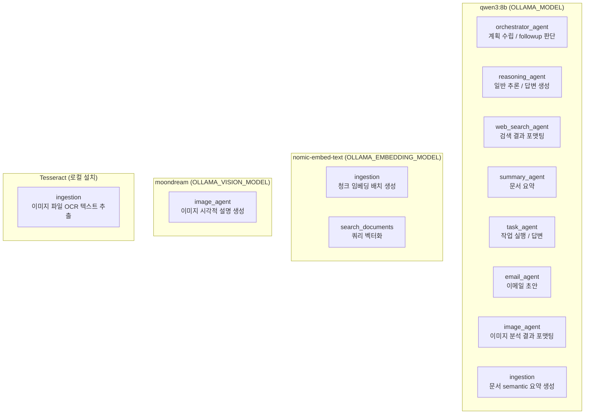
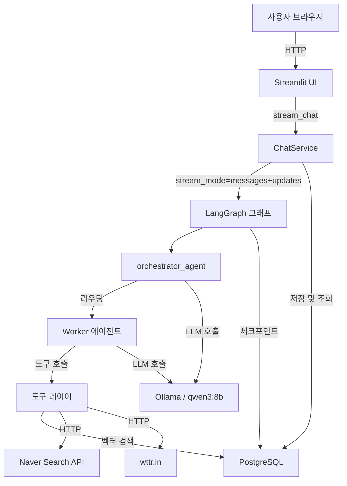
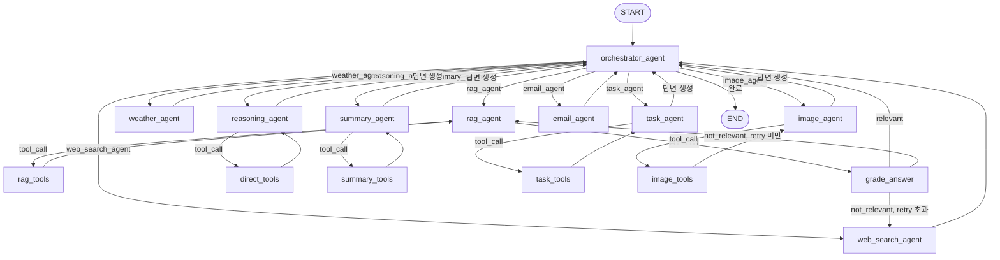
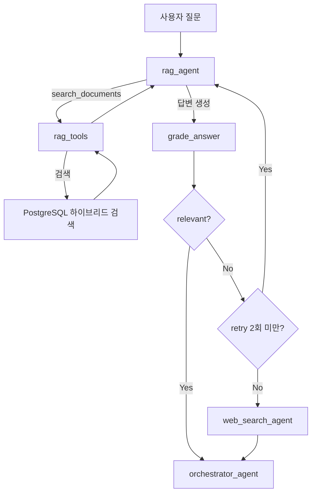
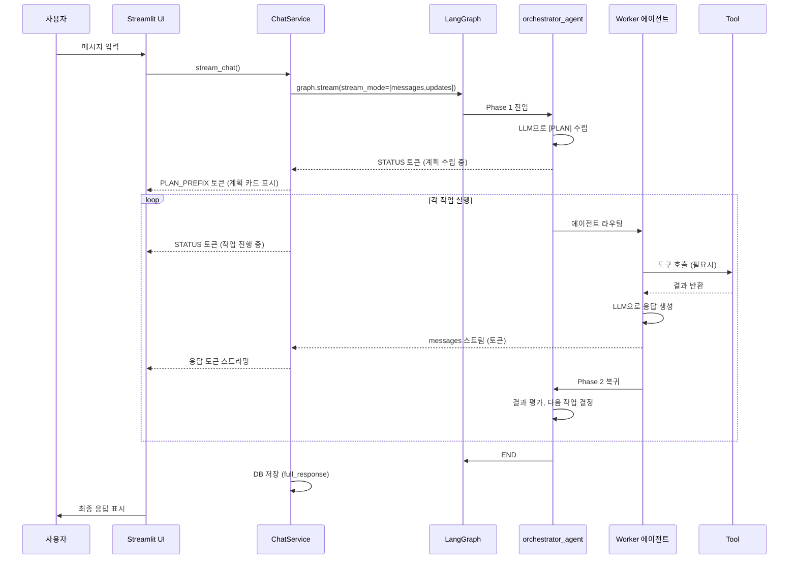
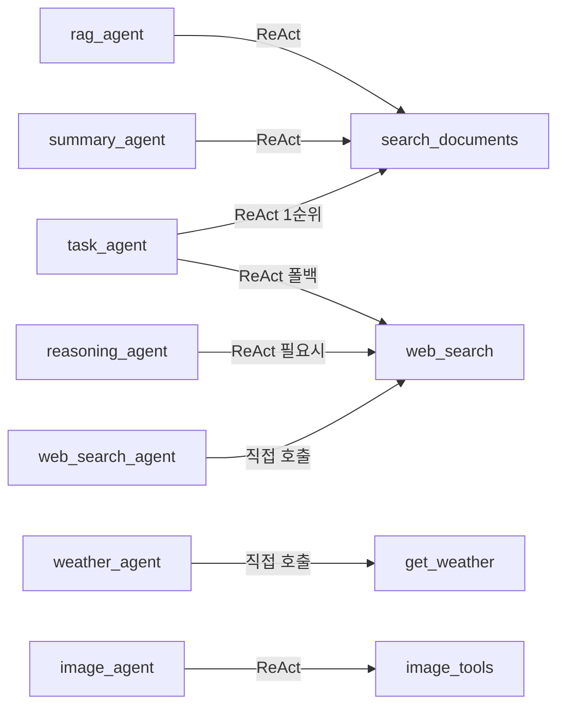
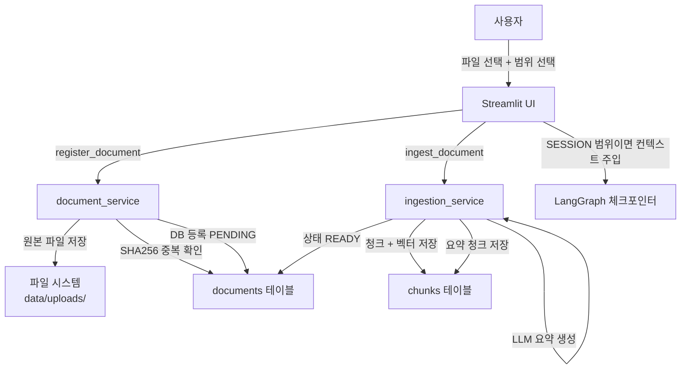
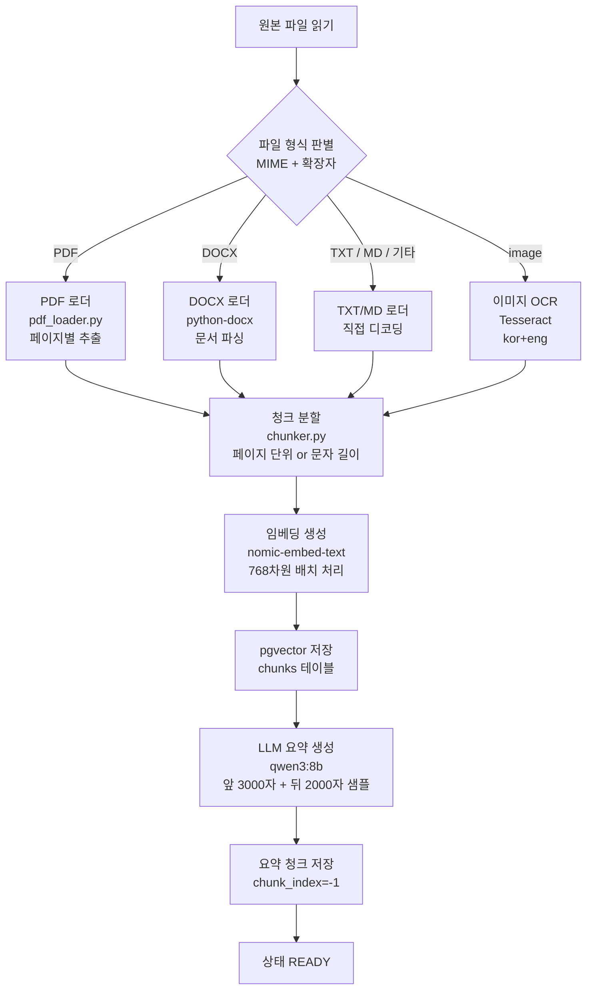

# ChatSELMA Bluebook v1.0

> 로컬 AI 챗봇 ChatSELMA의 현재 아키텍처 및 구현 설명서

---

## 목차

1. [시스템 개요](#1-시스템-개요)
2. [기술 스택](#2-기술-스택)
3. [사용 모델](#3-사용-모델)
4. [전체 아키텍처](#4-전체-아키텍처)
5. [멀티 에이전트 워크플로우](#5-멀티-에이전트-워크플로우)
   - 5.1 [오케스트레이터 중심 설계](#51-오케스트레이터-중심-설계)
   - 5.2 [에이전트 간 워크플로우 다이어그램](#52-에이전트-간-워크플로우-다이어그램)
   - 5.3 [RAG 파이프라인 (Corrective RAG)](#53-rag-파이프라인-corrective-rag)
   - 5.4 [요청 처리 전체 플로우](#54-요청-처리-전체-플로우)
6. [에이전트 상세](#6-에이전트-상세)
   - 6.1 [orchestrator_agent](#61-orchestrator_agent)
   - 6.2 [rag_agent](#62-rag_agent)
   - 6.3 [web_search_agent](#63-web_search_agent)
   - 6.4 [weather_agent](#64-weather_agent)
   - 6.5 [reasoning_agent](#65-reasoning_agent)
   - 6.6 [summary_agent](#66-summary_agent)
   - 6.7 [task_agent](#67-task_agent)
   - 6.8 [email_agent](#68-email_agent)
   - 6.9 [image_agent](#69-image_agent)
7. [도구 (Tools)](#7-도구-tools)
   - 7.1 [에이전트-도구 호출 관계](#71-에이전트-도구-호출-관계)
   - 7.2 [도구 목록 및 설명](#72-도구-목록-및-설명)
8. [스트리밍 토큰 시스템](#8-스트리밍-토큰-시스템)
9. [문서 업로드 및 인제스천](#9-문서-업로드-및-인제스천)
   - 9.1 [업로드 플로우](#91-업로드-플로우)
   - 9.2 [인제스천 파이프라인](#92-인제스천-파이프라인)
   - 9.3 [지원 파일 형식](#93-지원-파일-형식)
10. [데이터베이스 및 상태 관리](#10-데이터베이스-및-상태-관리)
11. [UI 레이어 (Streamlit)](#11-ui-레이어-streamlit)
12. [프로젝트 구조](#12-프로젝트-구조)

---

## 1. 시스템 개요

ChatSELMA는 LangGraph 기반의 멀티 에이전트 로컬 AI 챗봇이다. 사용자의 질문 의도를 오케스트레이터가 분석해 적절한 전문 에이전트에게 위임하고, 그 결과를 통합하여 응답한다.

**핵심 특징:**
- 오케스트레이터가 계획을 수립하고 전문 에이전트를 순차적으로 호출
- 문서 기반 RAG에 품질 평가(Corrective RAG) 적용
- 웹 검색, 날씨 조회, 이미지 분석 등 다양한 실시간 도구 통합
- 모든 연산은 로컬 환경에서 실행 (Ollama + PostgreSQL)
- Streamlit을 통한 실시간 스트리밍 응답 UI

---

## 2. 기술 스택

| 구성요소 | 기술 | 비고 |
|---------|------|------|
| LLM | qwen3:8b (Ollama) | `http://localhost:11434` |
| 멀티 에이전트 프레임워크 | LangGraph | PostgresSaver 체크포인터 |
| 벡터 DB | PostgreSQL (pgvector) | 하이브리드 검색 (BM25 + 벡터) |
| 임베딩 | 로컬 임베딩 모델 | |
| 웹 검색 | Naver Search API | `openapi.naver.com` |
| 날씨 | wttr.in | JSON 포맷 조회 |
| UI | Streamlit | 포트 8501 |
| 앱 DB | PostgreSQL | 세션/메시지/문서 저장 |
| 컨테이너 | Docker Compose | PostgreSQL 포함 |

---

## 3. 사용 모델

시스템에서 역할별로 서로 다른 모델을 사용한다. 모두 Ollama를 통해 로컬 실행된다.

### 모델별 담당 파트 전체 그림



---

### 언어 모델 (LLM)

| 항목 | 값 |
|------|-----|
| 모델 | `qwen3:8b` (환경변수 `OLLAMA_MODEL`로 교체 가능) |
| 엔드포인트 | `http://localhost:11434` |
| 기본값 (env_template) | `qwen2.5:7b` |
| 대안 모델 | `llama3.1:8b` 등 Ollama 호환 모델 |

**주요 파라미터:**

| 파라미터 | 기본값 | 환경변수 | 설명 |
|---------|--------|---------|------|
| `temperature` | 0.2 | `LLM_TEMPERATURE` | 응답 창의성 (orchestrator/grade_answer는 0.0 고정) |
| `num_ctx` | 8192 | `LLM_NUM_CTX` | 컨텍스트 윈도우 크기 |
| `num_predict` | 1024 | `LLM_NUM_PREDICT` | 최대 출력 토큰 수 |

**노드별 모델 설정 차이:**

| 노드 | temperature | num_ctx | num_predict | 비고 |
|------|-------------|---------|-------------|------|
| orchestrator_agent (계획) | 0.0 | settings | 256 | 결정론적 계획 생성 |
| orchestrator_agent (followup) | 0.0 | 2048 | 100 | 짧은 후속 제안 |
| reasoning_agent | settings | settings | settings | 일반 설정 사용 |
| web_search_agent | settings | settings | settings | 일반 설정 사용 |
| summary_agent | settings | settings | settings | 일반 설정 사용 |
| task_agent | settings | settings | settings | 일반 설정 사용 |
| ingestion (요약) | 0.1 | — | 700 | 문서 요약 전용 |

**`/no_think` 지시어:**
`qwen3` 계열 모델은 `<think>` 블록으로 내부 추론 과정을 출력한다. `rag_agent`, `web_search_agent` 등 빠른 응답이 필요한 노드는 시스템 프롬프트 끝에 `/no_think`를 포함해 thinking 과정을 생략한다.

---

### 임베딩 모델

| 항목 | 값 |
|------|-----|
| 모델 | `nomic-embed-text` |
| 환경변수 | `OLLAMA_EMBEDDING_MODEL` |
| 벡터 차원 | 768 |
| 용도 | 문서 청크 임베딩, 쿼리 벡터화 |
| 처리 방식 | 인제스천 시 배치(`get_embeddings_batch`), 검색 시 단건(`get_embeddings`) |

---

### 비전 모델 (이미지 분석)

| 항목 | 값 |
|------|-----|
| 모델 | `moondream` (환경변수 `OLLAMA_VISION_MODEL`로 교체 가능) |
| 대안 모델 | `llava:7b` 등 멀티모달 지원 모델 |
| `num_predict` | 512 |
| 용도 | `image_agent`의 `_call_vision_model()` — 이미지를 base64로 인코딩 후 시각적 설명 생성 |

---

## 4. 전체 아키텍처



---

## 5. 멀티 에이전트 워크플로우

### 7.1 오케스트레이터 중심 설계

모든 사용자 요청은 `orchestrator_agent`를 통해 진입한다. 오케스트레이터는 두 가지 페이즈로 동작한다.

- **Phase 1 (계획 수립):** LLM이 사용자 질문을 분석해 `[PLAN]` 형식의 작업 계획을 생성하고, 첫 번째 에이전트로 라우팅한다.
- **Phase 2 (평가 및 계속):** 각 에이전트가 완료되어 돌아오면 결과를 평가하고, 다음 작업으로 진행하거나 모두 완료되면 `END`로 종료한다. 후속 작업 제안(FOLLOWUP)도 이 단계에서 생성된다.

LLM 계획 수립이 실패하면 키워드 기반 `_fallback_agent()`가 작동해 단일 에이전트를 선택한다.

### 7.2 에이전트 간 워크플로우 다이어그램



### 7.3 RAG 파이프라인 (Corrective RAG)



### 7.4 요청 처리 전체 플로우



---

## 6. 에이전트 상세

### 7.1 orchestrator_agent

**역할:** 전체 워크플로우의 진입점이자 제어 허브.

**Phase 1 — 계획 수립**
- LLM에게 `ORCHESTRATOR_PLAN_PROMPT`와 사용자 질문을 전달
- 응답에서 `[PLAN]...[/PLAN]` 블록을 결정론적으로 파싱
- `_AGENT_ALIASES` 딕셔너리로 에이전트 이름 정규화
- LLM 실패 시 `_fallback_agent()`(키워드 기반)로 단일 작업 생성

**Phase 2 — 평가 및 계속**
- 마지막 AI 응답을 `_is_failed()` 패턴으로 품질 평가
- RAG 실패 시 `web_search_agent` 자동 추가
- 모든 작업 완료 시 `_llm_derive_followup()`으로 후속 제안 생성
- `route_from_orchestrator()` 함수로 다음 노드를 결정론적으로 반환

**프롬프트 포함 정보:**
- 에이전트 목록 및 선택 기준
- `[PLAN]` 출력 포맷 지시
- `today_context()` (프롬프트 끝에 주입 — 마지막 지시 효과)

---

### 7.2 rag_agent

**역할:** 로컬 지식베이스 문서 검색 (ReAct 루프).

- `search_documents` 도구를 자율적으로 호출해 관련 문서 검색
- 라우팅 접두사("rag에서", "문서에서" 등)를 쿼리에서 제거
- 최대 2회 도구 호출 후 강제 답변 생성 (무한루프 방지)
- 답변 생성 완료 시 `grade_answer`로 이동

**커스텀 ToolNode (`rag_tools_node`):**
- 라우팅 접두사 정규표현식으로 쿼리 정제
- 이전 메시지 히스토리 비교로 중복 쿼리 차단 → `[중복 쿼리 차단]` 반환

---

### 7.3 web_search_agent

**역할:** 웹에서 최신 정보 검색 후 결과 포맷팅.

- LLM 도구 결정 없이 규칙 기반으로 검색 쿼리 1~2개 생성 (`_plan_queries()`)
- 두 쿼리 모두 `web_search` 도구로 실행 후 결과 통합
- LLM으로 최종 답변 포맷팅
- `[FOLLOWUP]` 마커 파싱 + junk 필터링 후 `pending_followup` 상태 업데이트

---

### 7.4 weather_agent

**역할:** 날씨 전용 에이전트. LLM 호출 없이 도구 결과를 직접 반환.

- 사용자 쿼리에서 지역명을 정규표현식으로 추출
- `get_weather` 도구를 직접 호출 (LLM 판단 없음)
- 도구 결과를 `AIMessage`로 그대로 반환 → LLM 포맷팅 없음 → 빠름
- 조회 오류 시 `datetime.now()`로 정확한 오늘 날짜를 포함한 에러 메시지 반환

---

### 7.5 reasoning_agent

**역할:** 일반 추론, 코딩, 수학, 날짜/시간 질문 처리 (ReAct 루프).

- `web_search` 도구를 자율적으로 사용 가능
- `AGENT_SYSTEM_PROMPT` + `today_context()` 조합으로 현재 날짜 인식
- Generative Agentic Reasoning: 답변 후 후속 작업 자율 판단
- `[FOLLOWUP]` 마커 파싱 + junk 필터링 후 상태 업데이트

---

### 7.6 summary_agent

**역할:** 업로드된 문서 요약 및 정리 (ReAct 루프).

- `search_documents` 도구로 문서 내용 검색
- 검색 결과를 바탕으로 구조화된 요약 생성

---

### 7.7 task_agent

**역할:** 다단계 작업 실행 (ReAct 루프).

- `search_documents` 도구로 문서 검색
- **커스텀 ToolNode (`task_tools_node`):** 문서 검색 결과가 빈 경우 자동으로 `web_search` 폴백 실행

---

### 7.8 email_agent

**역할:** 이메일 초안 작성.

- 도구 없이 LLM만으로 이메일 구조(제목/본문/서명) 작성
- 완료 즉시 `orchestrator_agent`로 복귀

---

### 7.9 image_agent

**역할:** 이미지 시각적 내용 분석 (ReAct 루프).

- 이미지 처리 도구를 통해 업로드된 이미지 분석
- 이미지에서 텍스트, 객체, 레이아웃 등 시각 정보 추출

---

## 7. 도구 (Tools)

### 7.1 에이전트-도구 호출 관계



### 7.2 도구 목록 및 설명

#### `search_documents`

로컬 지식베이스(PostgreSQL + pgvector)에서 하이브리드 검색을 수행한다.

- **검색 방식:** RRF(Reciprocal Rank Fusion) 기반 BM25 키워드 + 벡터 코사인 유사도 결합
- **한국어 보완:** 한국어 쿼리의 경우 벡터 전용 검색을 추가 실행해 영문 표기 청크도 매칭
- **필터링:** RRF 점수 하한 + 벡터 거리 절대 상한 + 베스트 매치 기준 적응형 윈도우 3중 필터
- **저관련성 경고:** 최상위 결과가 기준 거리를 초과하면 `⚠️ 관련성 낮음` 경고를 응답에 포함
- **메타데이터:** 결과에 `[document_refs:...]` 블록을 포함해 UI가 출처 패널을 표시할 수 있게 함
- **Fallback:** 벡터 검색 결과가 없을 경우 파일명 기반 검색으로 전환

#### `web_search`

Naver Search API를 호출해 웹 검색 결과를 반환한다.

- **엔드포인트:** `https://openapi.naver.com/v1/search/webkr.json`
- **결과 수:** 5개
- **정렬:** 관련도순
- **후처리:** HTML 태그 제거 후 `제목 / 설명 / 출처` 형식으로 포맷
- **인증:** `X-Naver-Client-Id` / `X-Naver-Client-Secret` 헤더

#### `get_weather`

wttr.in API로 실제 날씨 데이터를 조회한다.

- **엔드포인트:** `https://wttr.in/{location}?format=j1&lang=ko`
- **데이터:** 현재 기온/체감온도/습도/바람/강수량/자외선 + 오늘/내일 예보
- **강수확률:** 현재 시각 이후 시간대 중 최대값과 해당 시간대 함께 표시
- **날짜:** `datetime.now()`로 실행 시점의 정확한 날짜 포함
- **권장사항:** 강수확률/기온/자외선/습도/풍속 임계값 기반으로 결정론적 생성
- **안정성:** 500 에러 시 1초 후 1회 재시도

---

## 8. 스트리밍 토큰 시스템

`chat_service.py`는 LangGraph의 `stream_mode=["messages","updates"]`를 처리해 특수 접두사 토큰을 UI에 전달한다.

| 토큰 접두사 | 값 | 의미 | UI 처리 |
|------------|-----|------|---------|
| `STATUS_PREFIX` | `\x00STATUS:` | 진행 상황 메시지 | 응답 위에 이탤릭 표시 |
| `THINK_PREFIX` | `\x00THINK:` | Chain-of-Thought 블록 | 접힌 expander로 표시 |
| `FOLLOWUP_PREFIX` | `\x00FOLLOWUP:` | 후속 작업 제안 | Yes/No 버튼으로 표시 |
| `PLAN_PREFIX` | `\x00PLAN:` | 오케스트레이터 계획 | 응답 위 파란 카드로 표시 |

**`[FOLLOWUP]` 필터링:**
- 스트리밍 중 `_strip_followup_stream()` 상태 머신이 `[FOLLOWUP]...[/FOLLOWUP]` 블록 제거
- 토큰 경계 분할 처리 (`[` / `FOLLOWUP` / `]` 로 나뉘어 도착하는 경우)
- DB 저장 전 regex로 잔여물 최종 제거

**날짜 컨텍스트 주입 (`today_context()`):**
- 각 노드의 SystemMessage 끝에 주입 (마지막 지시 효과 최대화)
- 형식: `[현재 날짜/시각 — 반드시 준수] 오늘: YYYY년 MM월 DD일 (X요일) 현재 시각: HH:MM`
- 실행 시점 `datetime.now()` 기반 — 하드코딩 없음

---

## 9. 문서 업로드 및 인제스천

### 9.1 업로드 플로우

사용자가 UI에서 파일을 업로드하면 `document_service` → `ingestion_service` 순으로 처리된다.



**문서 범위(Scope):**
- `GLOBAL` — 모든 세션에서 검색 가능
- `SESSION` — 업로드한 세션에서만 검색 가능. 인제스천 완료 후 LangGraph 체크포인터에 요약을 AI 메시지로 주입해 LLM이 컨텍스트를 즉시 인식하게 한다.

---

### 9.2 인제스천 파이프라인

`ingestion_service.ingest_document()`의 내부 단계. 파일 형식에 따라 텍스트 추출 경로가 분기된다.



| 단계 | 담당 모델/도구 | 설명 |
|------|--------------|------|
| **PDF 추출** | `pdf_loader.py` | 페이지별 텍스트 추출 |
| **DOCX 추출** | `python-docx` | 단락 구조 파싱 |
| **TXT/MD 추출** | 직접 디코딩 | UTF-8 디코딩 |
| **이미지 OCR** | **Tesseract** (`kor+eng`) | PIL로 이미지 열어 OCR 실행. 추출된 텍스트는 이후 동일 파이프라인으로 처리 |
| **청크 분할** | `chunker.py` | 페이지 단위 또는 `DEFAULT_CHUNK_SIZE=300` / `OVERLAP=80` |
| **임베딩 생성** | **`nomic-embed-text`** (768차원) | Ollama 배치 API 호출 |
| **pgvector 저장** | PostgreSQL + pgvector | 텍스트 + 벡터 + 메타데이터 저장 |
| **LLM 요약 생성** | **`qwen3:8b`** (`temperature=0.1`, `num_predict=700`) | 파일명·문서 유형·키워드·영문 키워드 포함 의미 요약 |
| **요약 청크 저장** | PostgreSQL | `chunk_index=-1`로 저장. 하이브리드 검색 시 자동 포함 |

> **이미지 업로드 시 주의:** OCR(Tesseract)은 텍스트가 명확한 이미지에 최적화되어 있다. 텍스트가 없거나 복잡한 이미지는 `image_agent`의 비전 모델(`moondream`)을 통해 대화 중 분석하는 것이 적합하다. 인제스천 시점의 OCR과 대화 시점의 비전 모델은 서로 다른 경로다.

---

### 9.3 지원 파일 형식

| 형식 | MIME 타입 | 처리 방법 |
|------|-----------|----------|
| PDF | `application/pdf` | 페이지별 텍스트 추출 |
| DOCX | `application/vnd.openxmlformats...` | python-docx 파싱 |
| TXT | `text/plain` | 직접 디코딩 |
| Markdown | `text/markdown` | 마크다운 파싱 |
| 이미지 (JPG/PNG 등) | `image/*` | OCR 텍스트 추출 |
| 텍스트 붙여넣기 | — | TXT로 변환 후 동일 파이프라인 |

---

## 10. 데이터베이스 및 상태 관리

### PostgreSQL 스키마 (주요 테이블)

| 테이블 | 역할 |
|--------|------|
| `sessions` | 대화 세션 (제목, 모드, 마지막 메시지 시각) |
| `messages` | 사용자/AI 메시지 (역할, 내용, 메타데이터) |
| `documents` | 업로드 문서 메타데이터 (파일명, 범위, 상태) |
| `chunks` | 문서 청크 + 벡터 임베딩 (pgvector) |
| `checkpoints` | LangGraph PostgresSaver 체크포인트 |

### LangGraph 상태 (`ChatState`)

| 필드 | 타입 | 설명 |
|------|------|------|
| `messages` | `list[BaseMessage]` | 대화 히스토리 (add_messages 축적) |
| `session_id` | `str` | 현재 세션 ID |
| `orchestrator_plan` | `list[OrchestratorTask]` | 오케스트레이터 작업 계획 |
| `orchestrator_task_idx` | `int` | 현재 실행 중인 작업 인덱스 |
| `answer_grade` | `str` | RAG 답변 품질 (`relevant`/`not_relevant`) |
| `rag_retry_count` | `int` | RAG 재시도 횟수 |
| `pending_followup` | `str` | 후속 작업 제안 (`질문:::작업`) |

### 문서 범위 (Scope)

| 범위 | 설명 |
|------|------|
| `GLOBAL` | 모든 세션에서 검색 가능 |
| `SESSION` | 업로드한 세션에서만 검색 |

---

## 11. UI 레이어 (Streamlit)

### 주요 화면 구성

- **사이드바:** 세션 목록, 대화 생성/삭제/이름 변경, 시스템 진단
- **태스크 패널 (사이드바):** task_agent 실행 시 작업 목록 및 진행 상황 실시간 업데이트
- **메인 채팅 영역:** 대화 히스토리, 스트리밍 응답
- **실행 계획 카드:** 응답 위에 파란 카드로 `🧩 실행 계획` 표시
- **CoT 블록:** `🤔 추론 과정` 접힌 expander로 표시
- **후속 제안 버튼:** `✅ 예, 해줘!` / `❌ 아니요` 버튼

### 파일 업로드 (팝오버)

채팅 입력창 왼쪽 `➕` 버튼으로 접근:
- 파일 업로드 탭: PDF, TXT, MD, DOCX, 이미지
- 텍스트 붙여넣기 탭: 직접 입력 후 TXT로 저장
- GLOBAL / SESSION 범위 선택

### 출처 패널

RAG 응답에 `[document_refs:...]` 메타데이터가 있으면 `📄 출처` expander를 표시하고, 원본 파일 다운로드 버튼을 제공한다.

---

## 12. 프로젝트 구조

```
newChatBot/
├── apps/
│   ├── chat_app.py          # Streamlit 메인 UI
│   └── static/              # 아이콘 등 정적 파일
├── backend/
│   ├── chatbot/
│   │   ├── graph.py         # LangGraph 그래프 정의
│   │   ├── state.py         # ChatState TypedDict 정의
│   │   ├── prompts.py       # 모든 시스템 프롬프트
│   │   ├── tools.py         # search_documents / web_search / get_weather
│   │   ├── language_utils.py # 텍스트 필터, today_context()
│   │   ├── routing.py       # 라우팅 유틸리티
│   │   └── nodes/
│   │       ├── orchestrator_agent.py  # 오케스트레이터
│   │       ├── rag_agent.py           # RAG (Corrective)
│   │       ├── grade_answer.py        # 결정론적 품질 평가
│   │       ├── web_search_agent.py    # 웹 검색
│   │       ├── weather_agent.py       # 날씨 (LLM 없음)
│   │       ├── reasoning_agent.py     # 일반 추론
│   │       ├── summary_agent.py       # 문서 요약
│   │       ├── task_agent.py          # 다단계 작업
│   │       ├── email_agent.py         # 이메일 작성
│   │       └── image_agent.py         # 이미지 분석
│   ├── services/
│   │   ├── chat_service.py     # 스트리밍 처리, DB 저장
│   │   ├── session_service.py  # 세션 관리
│   │   ├── document_service.py # 문서 등록
│   │   ├── ingestion_service.py # 문서 청킹/임베딩
│   │   └── health_service.py   # 시스템 진단
│   ├── database/
│   │   ├── connection.py
│   │   └── repositories/
│   │       ├── message_repository.py
│   │       ├── session_repository.py
│   │       ├── document_repository.py
│   │       └── chunk_repository.py    # hybrid_search
│   ├── rag/
│   │   ├── chunker.py         # 문서 청킹
│   │   ├── embeddings.py      # 임베딩 생성
│   │   └── retriever.py       # 검색 유틸
│   ├── documents/
│   │   ├── loaders.py         # 문서 로더 (PDF/TXT/MD/DOCX)
│   │   ├── pdf_loader.py      # PDF 전용 로더
│   │   └── image_loader.py    # 이미지 로더
│   └── config.py              # 환경 설정
├── data/
│   ├── uploads/               # 업로드 파일 저장
│   └── extracted/             # 추출 텍스트 캐시
├── docker/
│   └── postgres/init/         # DB 초기화 SQL
├── docker-compose.yml
└── requirements.txt
```
